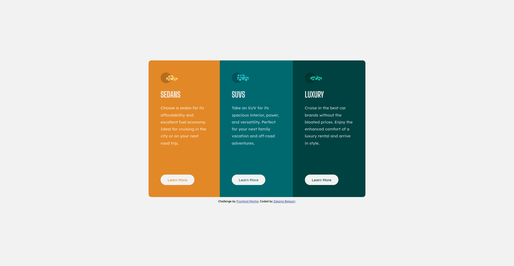
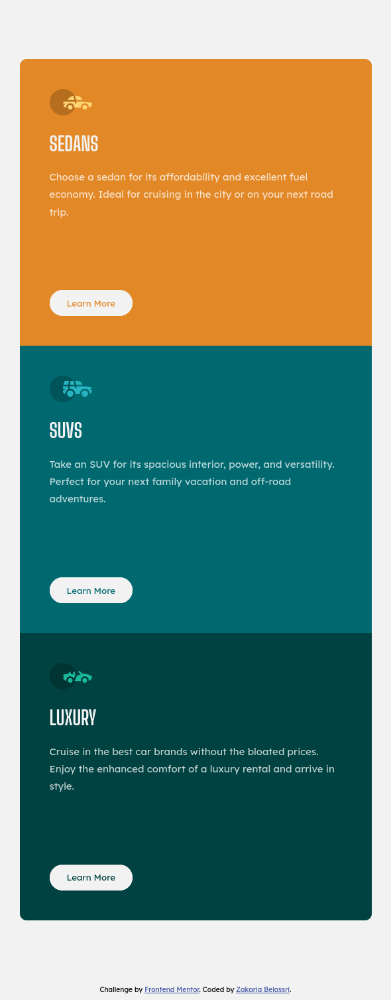

# Frontend Mentor - 3-column preview card component solution

This is a solution to the [3-column preview card component challenge on Frontend Mentor](https://www.frontendmentor.io/challenges/3column-preview-card-component-pH92eAR2-). Frontend Mentor challenges help you improve your coding skills by building realistic projects. 

## Table of contents

- [Overview](#overview)
  - [The challenge](#the-challenge)
  - [Screenshots](#screenshot)
  - [Links](#links)
- [My process](#my-process)
  - [Built with](#built-with)
  - [Useful resources](#useful-resources)
- [Author](#author)

## Overview

### The challenge

Users should be able to:

- View the optimal layout depending on their device's screen size
- See hover states for interactive elements

### Screenshots

### Links

- Solution URL: [Solution URL](https://www.frontendmentor.io/solutions/3-column-preview-card-using-css-flexbox-scss-and-bem-nIa6z9peiY)
- Live Site URL: [Live site URL](https://zakariabelassri.github.io/3-column-preview-card/)

## My process

### Built with

- Semantic HTML5 markup
- CSS Flexbox
- Sass
- BEM
- Mobile-first workflow

### Useful resources

- [Mdn Web Docs - CSS Layout - Media queries](https://developer.mozilla.org/en-US/docs/Learn/CSS/CSS_layout/Media_queries) - Beginner's guide to media queries.
- [CSS-Tricks - Animated media queries](https://css-tricks.com/animated-media-queries/#top-of-site) - Animation and transition examples.

## Author

- Frontend Mentor - [@zakariabelassri](https://www.frontendmentor.io/profile/zakariabelassri)
